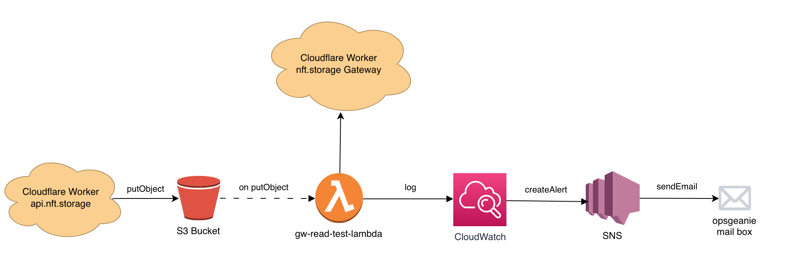

# gateway read test

> Lambda trigger on every nft.storage write that reads data from multiple gateways.

## Motivation

The `gateway-read-test-lambda` aims to track the IPFS gateway performance over time once writes happen in nft.storage, as well as alerting when availability issues happen.

It uses the [nft.storage gateway](https://github.com/nftstorage/nft.storage/tree/main/packages/gateway), which keeps a record of the performance of each backend gateway it uses, as well as which gateways had successfully retrieved a given [CID](https://docs.ipfs.io/concepts/content-addressing/#identifier-formats).

## High level Architecture

## Assumptions

For the gateway read test MVP there are a few assumptions in place and this lambda function will try to read a given CID from the gateway if:
- S3 Object Metadata has a "Complete" structure 
- S3 Object has a DagPB encoded root with a known size __acceptable__ (100MB) and the S3 directory for that root CID already has all the expected chunks

Once we have the new CAR chunking in place where last sent CAR has the root, we will be able to simplify the lambda logic to only try to fetch from the gateway when that CAR is received. With this, the current assumptions can be dropped.

## AWS Setup

This project already comes with a script for build and deploy (which is also integrated with Github Actions). However it needs:
- Project creation in AWS
  - It needs a role policy with S3 `s3:GetObject` and `s3:ListBucket` privilleges
- Runtime with Node.js 14.x
- Secrets setup in Repo secrets for automatic deploy
- Environment variables setup

## Alerts

We use Amazon CloudWatch to aggregate the generated lambda logs. Within CloudWatch metrics filters are setup to infer potential issues from the metrics. Amazon Simple Notification Service (SNS) will receive alerts from the metrics filters and publish them to subscribers (in this case an Opsgeanie email address).

Setup:
- Create opsgeanie email integration to receive AWS alerts and forward them to the team
- Create [SNS Topics](https://docs.aws.amazon.com/AmazonCloudWatch/latest/monitoring/US_SetupSNS.html) for alerts with subscription from opsgeanie email integration
  - `error-fetching-car` topic to track failed gateway reads of CARs 
- Create CloudWatch metric filters:
  - Error fetching CAR
  - Success fetching CAR
    - track strange response time variance

## What's next?

- CBOR
- Trigger an alert when data is not available from the nft.storage gateway within a reasonable timeframe.
- What to do with really large CAR files ?
